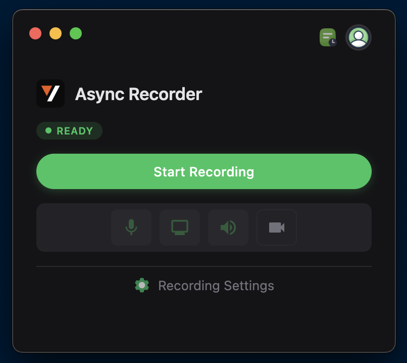
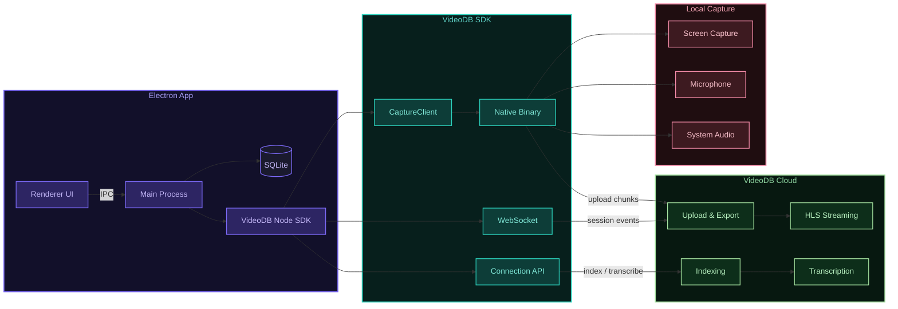

<!-- PROJECT SHIELDS -->
[![Electron][electron-shield]][electron-url]
[![Node][node-shield]][node-url]
[![License][license-shield]][license-url]
[![Stargazers][stars-shield]][stars-url]
[![Issues][issues-shield]][issues-url]
[![Website][website-shield]][website-url]

<!-- PROJECT LOGO -->
<br />
<p align="center">
  <a href="https://videodb.io/">
    
  </a>

  <h1 align="center">Async Recorder</h1>

  <p align="center">
    A Loom-style screen recording app built with Electron and the VideoDB Capture SDK.
    <br />
    <a href="https://docs.videodb.io"><strong>Explore the docs »</strong></a>
    <br />
    <br />
    <a href="#features">View Features</a>
    ·
    <a href="#download">Download</a>
    ·
    <a href="https://github.com/video-db/async-recorder/issues">Report Bug</a>
  </p>
</p>

<p align="center">
  
</p>

---

## Download

- **Apple Silicon (M1/M2/M3/M4)**: [async-recorder-1.5.2-arm64.dmg](https://artifacts.videodb.io/async-recorder/async-recorder-1.5.2-arm64.dmg)
- **Apple Intel**: [async-recorder-1.5.2-x64.dmg](https://artifacts.videodb.io/async-recorder/async-recorder-1.5.2-x64.dmg)

<p>
  <em>Pre-built DMGs are available for macOS. Windows users can run from source — see <a href="#development-setup">Development Setup</a>. Linux support coming soon.</em>
</p>

---

## Installation (Pre-built App)

If you downloaded the pre-built app from the links above:

1. **Mount the DMG** and drag Async Recorder to your Applications folder

2. **Remove quarantine attributes** to allow the app to run:
   ```bash
   xattr -cr /Applications/Async\ Recorder.app
   ```

3. **Launch the app** from Applications or Spotlight

4. **Grant system permissions** when prompted (Microphone and Screen Recording are required)

5. **Enter your VideoDB API key** on first launch ([console.videodb.io](https://console.videodb.io))

---

## Features

- Screen + microphone + system audio capture via [VideoDB Capture SDK](https://docs.videodb.io)
- Draggable camera bubble overlay
- Real-time session events via WebSocket
- Recording timer with live duration display
- Global keyboard shortcut (`Cmd+Shift+R`) to toggle recording
- System tray icon with recording state and context menu
- Native toast notifications for recording events
- Quick rename prompt after each recording
- Recording history with pipeline status tracking (Recording → Processing → Transcription → Ready)
- Auto-indexing with transcript generation and subtitles
- On-demand share link generation
- In-app video playback (HLS)

## Development Setup

### Prerequisites

- Node.js 18+
- VideoDB API Key ([console.videodb.io](https://console.videodb.io))

### Quick Start

```bash
npm install
npm start
```

On first launch, grant microphone and screen recording permissions, then enter your name and VideoDB API key.

## Usage

1. **Connect** — Enter your name and API key on first launch
2. **Record** — Click "Start Recording" to capture screen, mic, and system audio
3. **Camera** — Toggle the camera bubble overlay from source controls
4. **Review** — Click the history icon to browse past recordings, view transcripts, and share links
5. **Share** — Click "Share" on any recording to generate a fresh link via the VideoDB API

## Architecture



**Recording flow:** The app creates a `CaptureClient` which spawns a native binary to capture screen, mic, and system audio. Chunks are uploaded to VideoDB Cloud in real-time. A WebSocket connection delivers session events (started, stopped, exported) back to the app.

**Post-recording:** Once the video is exported, the app calls the VideoDB API to index spoken words, generate a transcript, and create a subtitled stream — all available for in-app HLS playback or sharing via URL.

## Project Structure

```
src/
├── main/                       # Electron Main Process
│   ├── index.js                # App entry point, window creation
│   ├── db/
│   │   └── database.js         # SQLite via sql.js
│   ├── ipc/                    # IPC handlers
│   │   ├── capture.js          # Recording start/stop, channels
│   │   ├── permissions.js      # Permission check/request
│   │   ├── camera.js           # Camera bubble control
│   │   └── auth.js             # Login, logout, onboarding
│   ├── lib/                    # Utilities
│   │   ├── config.js           # App config
│   │   ├── logger.js           # File + console logging
│   │   ├── paths.js            # App paths (DB, config, logs)
│   │   └── videodb-patch.js    # Binary relocation for packaged apps
│   └── services/
│       ├── videodb.service.js  # VideoDB SDK wrapper
│       ├── session.service.js  # Session tokens, WebSocket, sync
│       └── insights.service.js # Transcript + subtitle indexing
├── renderer/                   # Renderer scripts (context-isolated)
│   ├── renderer.js             # Main window UI
│   ├── history.js              # History window + HLS player
│   ├── camera.js               # Camera bubble
│   ├── pages/                  # HTML pages
│   └── styles/                 # CSS
└── preload/
    └── preload.js              # Context bridge (renderer ↔ main)

build/
├── afterPack.js                # electron-builder hook (codesign, plist patch)
├── entitlements.mac.plist      # macOS entitlements
└── icon.icns                   # App icon
```

## Configuration

| Variable | Description | Default |
|----------|-------------|---------|
| `VIDEODB_API_URL` | Override the VideoDB API base URL (for dev/staging) | Production API |

Set in a `.env` file at the project root, or as an environment variable.

## Troubleshooting

### Permissions denied
- **macOS**: System Settings → Privacy & Security → enable Screen Recording / Microphone / Camera
- **Windows**: Settings → Privacy → enable Microphone / Camera access

### Camera not showing
- Toggle camera off/on in source controls
- Check Camera permission in system settings

### Reset
```bash
# Delete the app database (stored in Electron userData)
# macOS
rm ~/Library/Application\ Support/async-recorder/async-recorder.db
rm ~/Library/Application\ Support/async-recorder/config.json
```
Then run `npm start`

## Building

```bash
# Build directory (for testing)
npm run pack

# Build DMG installers (macOS arm64 + x64)
npm run dist
```

## License

MIT

## Community & Support

- **Docs**: [docs.videodb.io](https://docs.videodb.io)
- **Issues**: [GitHub Issues](https://github.com/video-db/async-recorder/issues)
- **Discord**: [Join community](https://discord.gg/py9P639jGz)
- **Console**: [Get API key](https://console.videodb.io)

---

<p align="center">Made with ❤️ by the <a href="https://videodb.io">VideoDB</a> team</p>

---

<!-- MARKDOWN LINKS & IMAGES -->
[electron-shield]: https://img.shields.io/badge/Electron-39.0-47848F?style=for-the-badge&logo=electron&logoColor=white
[electron-url]: https://www.electronjs.org/
[node-shield]: https://img.shields.io/badge/Node.js-18+-339933?style=for-the-badge&logo=node.js&logoColor=white
[node-url]: https://nodejs.org/
[license-shield]: https://img.shields.io/github/license/video-db/async-recorder.svg?style=for-the-badge
[license-url]: https://github.com/video-db/async-recorder/blob/main/LICENSE
[stars-shield]: https://img.shields.io/github/stars/video-db/async-recorder.svg?style=for-the-badge
[stars-url]: https://github.com/video-db/async-recorder/stargazers
[issues-shield]: https://img.shields.io/github/issues/video-db/async-recorder.svg?style=for-the-badge
[issues-url]: https://github.com/video-db/async-recorder/issues
[website-shield]: https://img.shields.io/website?url=https%3A%2F%2Fvideodb.io%2F&style=for-the-badge&label=videodb.io
[website-url]: https://videodb.io/
